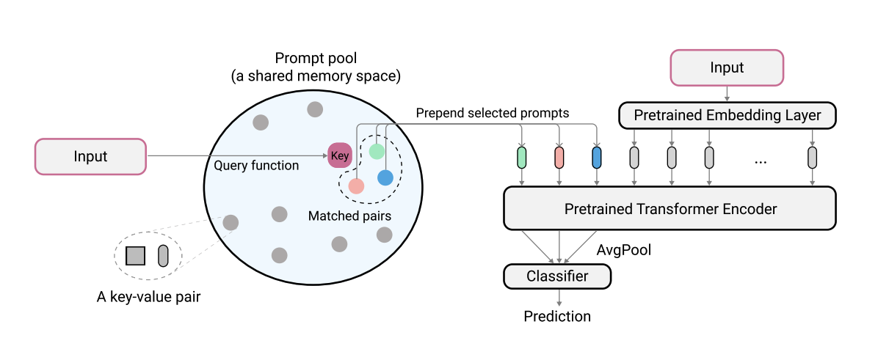
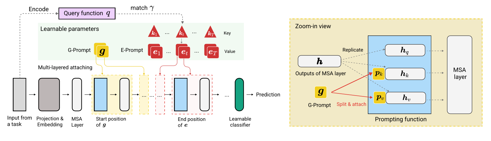

# [Learning to Prompt for Continual Learning (L2P)](https://arxiv.org/pdf/2112.08654.pdf) and [DualPrompt: Complementary Prompting for Rehearsal-free Continual Learning](https://arxiv.org/pdf/2204.04799.pdf) Official Jax Implementation

This codebase contains the implementation of two continual learning methods: **L2P (CVPR2022)** and **DualPrompt (ECCV2022)**.

## Introduction
L2P is a novel continual learning technique which learns to dynamically prompt a pre-trained model to learn tasks sequentially under different task transitions. Different from mainstream rehearsal-based or architecture-based methods, L2P requires neither a rehearsal buffer nor test-time task identity. L2P can be generalized to various continual learning settings including the most challenging and realistic task-agnostic setting. L2P consistently outperforms prior state-of-the-art methods. Surprisingly, L2P achieves competitive results against rehearsal-based methods even without a rehearsal buffer.
<p align="center">

</p>
DualPrompt improves upon L2P by attaching complementary prompts to the pre-trained backbone, and then formulates the objective as learning task-invariant and task-specific “instructions". With extensive experimental validation, DualPrompt consistently sets state-of-the-art performance under the challenging class-incremental setting. In particular, DualPrompt outperforms recent advanced continual learning methods with relatively large buffer sizes. We also introduce a more challenging benchmark, Split ImageNet-R, to help generalize rehearsal-free continual learning research.
<p align="center">

</p>


Code is written by Zifeng Wang. Acknowledgement to https://github.com/google-research/nested-transformer.

This is not an officially supported Google product.

## Enviroment setup
```
pip install -r requirements.txt
```
After this, you may need to adjust your jax version according to your cuda driver version so that jax correctly identifies your GPUs (see [this issue](https://github.com/google/jax/issues/5231) for more details).

Note: The codebase has been throughly tested under the TPU enviroment using the newest JAX version. We are currently working on verifying the GPU environment.

## Dataset preparation
Before running experiments for 5-datasets and CORe50, additional dataset preparation step should be conducted as follows:

1. Download CORe50 classification benchmark here: https://vlomonaco.github.io/core50/ and download not-mnist here: http://yaroslavvb.com/upload/notMNIST/
2. Transform them into TFDS compatible form following the tutorial in https://www.tensorflow.org/datasets/add_dataset
3. Replace corresponding dataset paths `"PATH_TO_CORE50"` and `"PATH_TO_NOT_MNIST"` in `input_pipeline.py` by the destination paths in step 2


## Getting pretrained ViT model
ViT-B/16 model used in this paper can be downloaded at [here](https://storage.googleapis.com/vit_models/imagenet21k/ViT-B_16.npz).
Note: Our codebase actually supports various sizes of ViTs. If you would like to try variations of ViTs, feel free to change the `config.model_name` in the config files, following the valid options defined in [vit.py](models/vit.py).


## Instructions on running L2P
We provide the configuration file to train and evaluate L2P and DualPrompt on multiple benchmarks in [configs](configs/).


To run L2P on benchmark datasets:

```
python main.py --my_config configs/$L2P_CONFIG --workdir=./l2p --my_config.init_checkpoint=<ViT-saved-path/ViT-B_16.npz>
```
where `$L2P_CONFIG` can be one of the followings: `[cifar100_l2p.py, five_datasets_l2p.py, core50_l2p.py, cifar100_gaussian_l2p.py]`.

Note: we run our experiments using 8 V100 GPUs or 4 TPUs, and we specify a per device batch size of 16 in the config files. This indicates that we use a total batch size of 128.


To run DualPrompt on benchmark datasets:

```
python main.py --my_config configs/$DUALPROMPT_CONFIG --workdir=./dualprompt --my_config.init_checkpoint=<ViT-saved-path/ViT-B_16.npz>
```
where `$DUALPROMPT_CONFIG` can be one of the followings: `[imr_dualprompt.py, cifar100_dualprompt.py]`.


## Visualize results
We use tensorboard to visualize the result. For example, if the working directory specified to run L2P is `workdir=./cifar100_l2p`, the command to check result is as follows:

```
tensorboard --logdir ./cifar100_l2p
```
Here are the important metrics to keep track of, and their corresponding meanings:

| Metric    | Description |
| ----------- | ----------- |
| accuracy_n      | Accuracy of the n-th task       |
| forgetting   | Average forgetting up until the current task       |
| avg_acc  | Average evaluation accuracy up until the current task      |


## Cite
```
@inproceedings{wang2022learning,
  title={Learning to prompt for continual learning},
  author={Wang, Zifeng and Zhang, Zizhao and Lee, Chen-Yu and Zhang, Han and Sun, Ruoxi and Ren, Xiaoqi and Su, Guolong and Perot, Vincent and Dy, Jennifer and Pfister, Tomas},
  booktitle={Proceedings of the IEEE/CVF Conference on Computer Vision and Pattern Recognition},
  pages={139--149},
  year={2022}
}

@article{wang2022dualprompt,
  title={DualPrompt: Complementary Prompting for Rehearsal-free Continual Learning},
  author={Wang, Zifeng and Zhang, Zizhao and Ebrahimi, Sayna and Sun, Ruoxi and Zhang, Han and Lee, Chen-Yu and Ren, Xiaoqi and Su, Guolong and Perot, Vincent and Dy, Jennifer and others},
  journal={arXiv preprint arXiv:2204.04799},
  year={2022}
}
```
